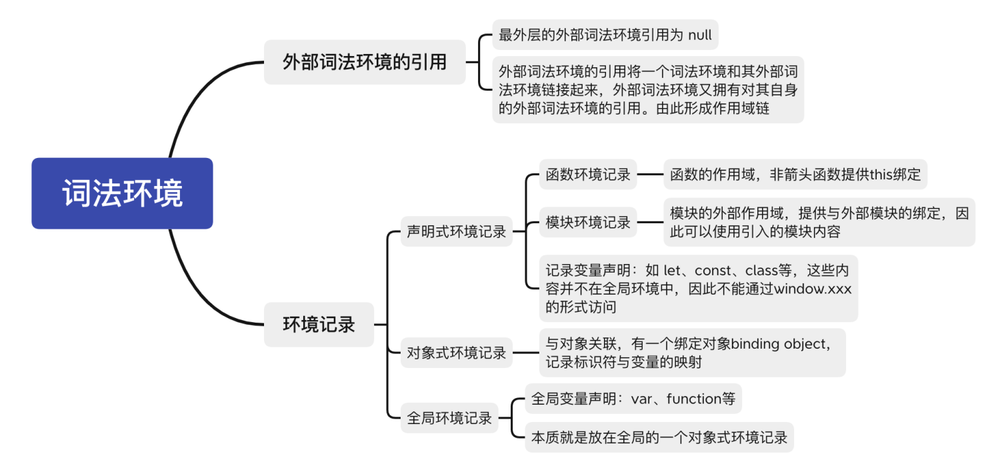

​

`JavaScript` 的代码的执行大致分为三个阶段。

语法分析属于编译器通用内容，不多赘述。重点了解编译相关的内容，编译的核心是：执行上下文的创建。
​

# 执行上下文的创建

JavaScript 运行环境包括`全局环境`、`函数环境`和`eval`
​

## 全局环境
第一次载入 `JavaScript` 代码时，首先会创建一个全局环境。全局环境位于最外层，直到应用程序退出后（例如关闭浏览器和网页）才会被销毁。
​

## 函数环境
每个函数都有自己的运行环境，当函数被调用时，则会进入该函数的运行环境。当该环境中的代码被全部执行完毕后，该环境会被销毁。不同的函数运行环境不一样，即使是同一个函数，在被多次调用时也会创建多个不同的函数环境。

## 创建
在不同的运行环境中，变量和函数可访问的其他数据范围不同，环境的行为（比如创建和销毁）也有所区别。而每进入一个不同的运行环境时，`JavaScript` 都会创建一个新的执行上下文。
​

执行上下文的创建过程包括：

- 建立作用域链（`Scope Chain`）
- 创建变量对象（`Variable Object`，简称 VO）
- 确定 this 的指向

​

### 变量对象
每个执行上下文都会有一个关联的变量对象，该对象上会保存这个上下文中定义的所有变量和函数。
​

浏览器中，全局环境的变量对象是`window`，因此所有的全局变量和函数都是作为`window`对象的属性和方法创建的。相应的，在 `Node` 中全局环境的变量对象则是`global`对象。
​

**创建变量对象将会创建arguments对象（仅函数环境下），同时会检查当前上下文的函数声明和变量声明。**
**​**

- 对于变量声明：此时会给变量分配内存，并将其初始化为`undefined`（该过程只进行定义声明，执行阶段才执行赋值语句）。

​

- 对于函数声明：此时会在内存里创建函数对象，并且直接初始化为该函数对象。
> *这里就是变量提升和函数提升的处理过程。函数声明提升会优先于变量声明提升。

​

#### Q: 变量提升存在什么问题，怎么解决？
变量提升容易带来变量在预期外被覆盖掉的问题，同时还可能导致本应该被销毁的变量没有被销毁等情况。因此 ES6 中引入了let和const关键字，从而使 `JavaScript` 也拥有了块级作用域。

### 作用域
在各类编程语言中，作用域分为静态作用域和动态作用域。
`JavaScript` 采用的是词法作用域`Lexical Scoping`，也就是静态作用域。词法作用域中的变量，在编译过程中会产生一个确定的作用域。
这个作用域即当前的执行上下文，在 ES5 后我们使用词法环境`Lexical Environment`替代作用域来描述该执行上下文。
​

`JavaScript` 中，词法环境分为`词法环境`和`变量环境`。

   - 变量环境用来记录`var/function`等变量声明；
   - 词法环境是用来记录`let/const/class`等变量声明。

创建变量过程中会进行函数提升和变量提升，JavaScript 会通过词法环境来记录函数和变量声明。通过使用两个词法环境（而不是一个）分别记录不同的变量声明内容，JavaScript 实现了支持块级作用域的同时，不影响原有的变量声明和函数声明。

作用域就可以理解为词法环境。词法环境具体内容如下图。
​

> JavaScript 代码在编译阶段创建变量对象VO，进行函数声明和变量声明，函数赋值为函数表达式，变量赋值为 undefined。进入执行阶段之后才给变量赋值，此时变量对象VO转换为活动对象AO。转换为AO之后变量才可以被访问。

#### ​

JS 引擎执行代码并不是与其他编译型语言一样，先编译后执行。如果在foo函数中调用了bar函数，那么bar函数的编译阶段是在foo函数的执行阶段中完成的。
​

在闭包当中，外层函数执行完毕，整个执行上下文被销毁，但是外层函数作用域中的变量对象仍然被内层函数的作用域链引用着，并可以进行访问。所以即使创建它的执行上下文已经销毁，它仍然被保留在内存中。
​

### this指向

